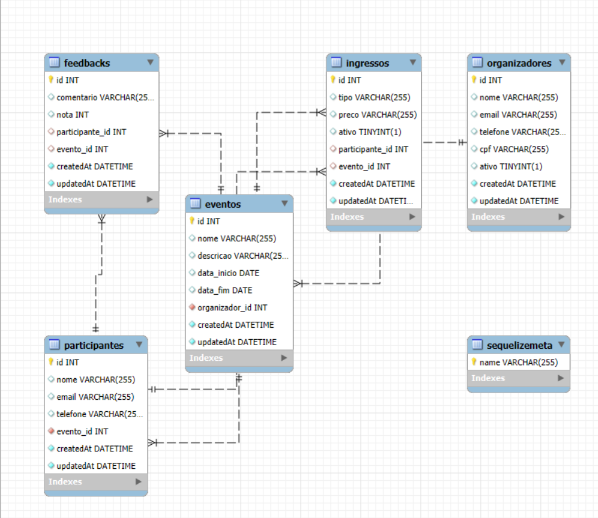

# API REST EVENTOS (BÁSICA)
### Por: Guilherme Jorge

##### API REST baseada em modelo criado pelo ChatGPT

*Modelo:* 

---

#### Funções:

### **Organizador**
- **Endpoints:**
  - `GET /organizador`  
    Retorna todos os organizadores ativos.

  - `GET /organizador/inativo`  
    Retorna todos os organizadores inativos.

  - `GET /organizador/todos`  
    Retorna todos os organizadores (ativos e inativos).

  - `GET /organizador/:id`  
    Retorna um organizador específico pelo ID.

  - `POST /organizador`  
    Cria um novo organizador.  
    **Modelo:**
    | Campo     | Tipo    | Requisitos                                                    |
    |-----------|---------|--------------------------------------------------------------|
    | Nome      | STRING  | Deve ter entre 3 e 70 caracteres                              |
    | Email     | STRING  | Deve ser único e ser um e-mail válido                         |
    | CPF       | STRING  | Deve ser único e ser um CPF válido (formatado automaticamente)|
    | Telefone  | STRING  | Deve ser único e válido (formatado automaticamente)           |
    | Ativo     | BOOLEAN | Deve ser true ou false                                        |

  - `PUT /organizador/:id`  
    Atualiza os dados de um organizador específico.

  - `DELETE /organizador/:id`  
    Exclui o organizador especificado e apaga todos os registros relacionados (cascade delete).

---

### **Evento**
- **Endpoints:**
  - `GET /evento`  
    Retorna todos os eventos.

  - `GET /organizador/:organizador_id/evento`  
    Retorna todos os eventos associados a um organizador.

  - `GET /evento/:id`  
    Retorna informações de um evento específico pelo ID.

  - `GET /organizador/:organizador_id/evento/:id`  
    Retorna um evento específico de um organizador.

  - `POST /evento`  
    Cria um novo evento.  
    **Modelo:**
    | Campo          | Tipo      | Requisitos                                                    |
    |----------------|-----------|----------------------------------------------------------------|
    | Nome           | STRING    | Deve ter entre 2 e 100 caracteres                              |
    | descricao      | STRING    | Deve ter entre 3 e 500 caracteres                              |
    | data_inicio    | DATEONLY  | Deve ser uma data no formato yyyy-mm-dd e ser menor que data_fim |
    | data_fim       | DATEONLY  | Deve ser uma data no formato yyyy-mm-dd e ser maior que data_inicio |
    | organizador_id | INTEGER   | Deve ser o ID de um organizador existente                      |

  - `POST /organizador/:organizador_id/evento`  
    Cria um evento associado a um organizador específico.  
    (O ID do organizador é preenchido automaticamente).

  - `PUT /evento/:id`  
    Atualiza os dados de um evento específico.

  - `PUT /organizador/:organizador_id/evento/:id`  
    Atualiza os dados de um evento específico associado a um organizador.

  - `DELETE /evento/:id`  
    Exclui um evento e apaga todos os registros relacionados (cascade delete).

  - `DELETE /organizador/:organizador_id/evento/:id`  
    Exclui um evento de um organizador específico e apaga todos os registros relacionados (cascade delete).

---

### Observações:
- **Não usei soft delete**  
- **Dê um `npm i` e instale os pacotes**  
- **Crie seu próprio banco de dados MySQL e conecte**  
